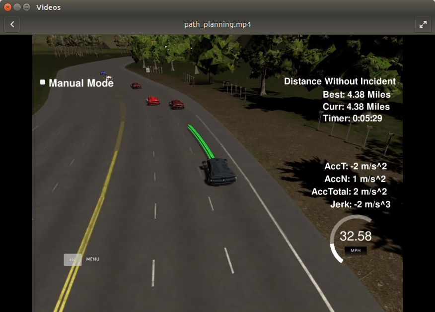

# [Rubric](https://review.udacity.com/#!/rubrics/1020/view)

## Compilation

### The code compiles correctly.

New files were added:
- src/spline.cpp: To calculate splines instead of polynomials for trajectory generation.
- src/vehicle.cpp: Vehicle class that contains logic to manage the finite state machine as well as the methods to generate the trajectory.
- src/cost.cpp: Cointains cost functions for the Vehicle class.

## Valid trajectories

### The car is able to drive at least 4.32 miles without incident.
I ran the simulator several times. Sometimes the car takes a bit too much time to complete a lane change, thus getting the wrong lane warning.
Besides some corner cases, the car drives around safely:

### The car drives according to the speed limit.
No speed limit red message was seen.

### Max Acceleration and Jerk are not Exceeded.
Max jerk red message was not seen.

### Car does not have collisions.
Most of the time there are no collisions, although some corner cases appear where the car crashes.
These crashes are usually due to other cars changing lanes when they're close to the ego vehicle. The ego vehicle assumes other car trajectories to stay inside their lane.

### The car stays in its lane, except for the time between changing lanes.
The car stays in its lane most of the time except when changing the lane.
As mentioned before, there are some cases where other cars approximate rapidly when performing a lane change may make the ego vehicle try to go back to its own lane.

### The car is able to change lanes
Car is able to identify near lanes with higher average speed, calculate possible collisions and maximize the distance to other cars to decide if it wants to change lane.

## Reflection
I worked using the code showed in the walkthrough, then refactored code related to vehicle dynamics and state by creating a class of its own.
This made the code cleaner and easier to inspect.
While cost functions make a decent job, in my opinion a search algorithm could be better suited for finding the best possible course.
There are many possibilities to choose from when driving, meaning we would need many complex cost functions to take them into account.

### Prediction [line 253 to line 375]
This part of the code deals with the telemetry and sensor fusion data. We try to get information from the environment such as:

- Is there is a car in front/behind us in the desired lane.
- Generate the trajectories of non-ego vehicles. The algorithm assumes constant velocity and same lane.
- Check for possible collisions between ego vehicle trajectory and other vehicle's trajectories.

When checking for cars nearby we use a distance of 50m around the car.

### Behavior [line 44 to line 105]
This part decides wether to keep lane, change right or change left.
We generate a new vehicle for each possible next state and evaluate their costs, we then keep the one with the lowest cost value.
The cost considered are:
- Inefficiency: Compare average speed between lanes.
- Proximity: How close the ego vehicle is to other cars.
- Change lane: This is a bias towards keeping the lane, otherwise the trajectory will be wiggly, as it tries to optimize by constantly changing lanes (in some scenarios).
- Collision: Check for possible collisions with other vehicles.

### Trajectory [line 107 to line 251]
The trajectory is generated by adding new points to the existing trajectory that depend on the reference velocity (velocity at the last point of the trajectory so far).
The reference velocity is generated taking into account velocity of other vehicles in the objective lane and a distance that we want to keep from other vehicles if possible.
First we get the last 2 points of the last trajectory, if there was no previous trajectory we use the current position and generate the point before the current one.
Then we generate 3 anchor points. For lane changes to be smooth we generate these anchor points starting at 60m away from the car in increments of 30m.
After that we transform to local car coordinates, create the spline from the previous trajectory plus some generated points that come from the spline we just generated,
and transform back to world coordinates.

### Video
https://youtu.be/6lEwFAReQw0
